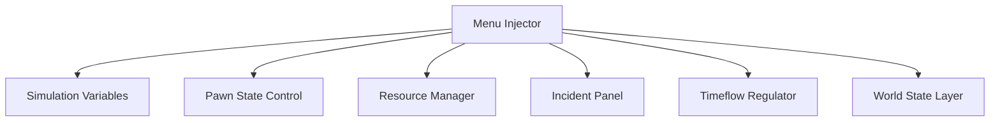

## Overview

Positioned as a live control interface, **RimWorld Mod Menu** operates alongside the simulation layer of RimWorld, exposing adjustable systems related to pawns, resources, events, and world logic. The menu focuses on real-time state access rather than save editing, allowing controlled interaction with ongoing simulations. Common secondary associations include colony control menu, runtime simulation toolkit, mod overlay interface, and system toggle panel. All interactions are applied dynamically and remain scoped to the active session.

---

## Simulation Variable Console

* Read and write access to core simulation values
* Numeric, boolean, and flag-based controls
* Immediate propagation to active systems

**Feature intent:**
Provides direct interaction with the simulation state as it updates, enabling controlled manipulation of live variables.

---

## Pawn State and Trait Controls

* Health, mood, and need adjustment
* Trait enable/disable toggles
* Status effect inspection

**In-game behavior:**
Modifies pawn-related states at runtime without altering character generation or save structure.

---

## Resource and Inventory Management Layer

* Stack quantity adjustment
* Global resource freezing
* Per-item filtering

**Feature intent:**
Allows precise control over colony resources while respecting internal stack and storage rules.

---

## Event and Incident Trigger Panel

* Manual incident execution
* Threat and storyteller event selection
* Cooldown and repetition limits

**In-game behavior:**
Injects events into the simulation pipeline independently of storyteller pacing.

---

## Timeflow and Speed Regulation

* Custom speed multipliers
* Pause-state overrides
* Tick-rate normalization

**Feature intent:**
Controls simulation time progression without desynchronizing AI or job systems.

---

## World and Map State Controls

* Fog of war toggles
* Map condition overrides
* Terrain and object state flags

**In-game behavior:**
Exposes world-level visibility and condition states while preserving map integrity.

---

## Mod Menu Interface and Input Layer

* Docked or floating UI modes
* Hotkey-driven toggles
* Context-sensitive visibility

**Feature intent:**
Ensures fast access to controls without interrupting colony management workflows.

---

---

## FAQ

**Does the mod menu alter save files?**
No, all changes are applied to the active simulation state only.

**Can pawn traits be reverted?**
Yes, trait toggles and state changes support runtime reset.

**Are triggered incidents permanent?**
Incidents follow normal resolution rules once injected.

**Does time speed affect AI behavior?**
Speed adjustments are normalized to prevent job or pathing errors.

**Can resources be filtered by category?**
Item controls support category- and type-based filtering.

**Is the menu usable with other mods?**
The interface operates independently of content mods.

---

## Feature Summary

* Live simulation variable access
* Pawn health, mood, and trait control
* Resource and inventory management
* Manual event and incident triggering
* Timeflow and speed regulation
* World and map state adjustment
* Runtime mod menu interface with hotkeys

---
